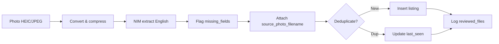

# Uniroom Data Extractor

Extract housing listings from photos of university bulletin boards and store them in MongoDB. Supports **HEIC** (iPhone) photos, **English-only** output (Italian ads are translated), **partial/missing data flags**, per-listing **source photo filenames**, and a **reviewed files** registry so you never lose track of what has been processed.

You can run the pipeline in two ways:

| Mode | Best for |
|------|----------|
| **CLI** | Batch work from `input/`, local debugging, reprocessing with `--force` |
| **Telegram bot** | Mobile uploads: send a photo or image file in chat → structured data in MongoDB |

---

## Quick start: CLI

### One photo (direct)

```bash
cd /home/kaveh/Projects/uniroom-data-extractor
python3 -m venv .venv && source .venv/bin/activate
pip install -r requirements.txt
cp .env.example .env   # add NVIDIA_API_KEY, MONGO_URI, etc.

set -a && source .env && set +a
python process_bulletin_board.py input/your_photo.heic
```

Reprocess a file that was already reviewed:

```bash
python process_bulletin_board.py input/your_photo.heic --force
```

### Photo menu (arrow keys)

Interactive picker for everything in `input/`:

```bash
set -a && source .env && set +a
python select_photo.py
```

↑↓ to move, Enter to select. Choose **All Photos** to batch-process the folder, or pick one file.

```bash
python select_photo.py --force
python select_photo.py --format png
```

### Docker CLI (menu)

```bash
./docker-run.sh
# or single file:
docker compose run --rm app python process_bulletin_board.py input/your_photo.heic
```

Put images in `input/` before running. MongoDB starts automatically via Docker Compose.

---

## Quick start: Telegram bot

Send a bulletin board image in Telegram (as a **photo** or as an **image file**). The bot downloads it, runs the same extraction pipeline as the CLI, and replies with a summary (listings found, inserted, duplicates updated).

### 1. Configure

Add your bot token to `.env` (from [@BotFather](https://t.me/BotFather)):

```bash
TELEGRAM_BOT_TOKEN=your_bot_token_here
```

Other required variables are the same as CLI: `NVIDIA_API_KEY`, `MONGO_URI`, etc. See `.env.example`.

### 2. Run locally

```bash
source .venv/bin/activate
set -a && source .env && set +a

# Start MongoDB if not already running (Docker or local)
docker compose up -d mongo   # optional: Docker MongoDB

python telegram_bot.py
```

Uploaded images are saved under `input/telegram/` (override with `TELEGRAM_UPLOAD_DIR`).

### 3. Run with Docker (recommended for a always-on bot)

```bash
docker compose build telegram
docker compose up -d mongo telegram
```

Logs:

```bash
docker compose logs -f telegram
```

Stop:

```bash
docker compose stop telegram
```

### Using the bot in Telegram

1. Open your bot in Telegram (link from BotFather).
2. Send `/start` or `/help`.
3. Send a bulletin board image:
   - **Photo** — normal camera/gallery send (compressed JPEG), or
   - **File** — send as document (keeps HEIC/PNG quality; HEIC, JPEG, PNG, WebP supported).
4. Wait for the “Processing…” message (NIM analysis can take 30–120 seconds).
5. Read the summary; data is in MongoDB (`housing_listings`, `reviewed_files`).

Telegram filenames look like `tg_<chat_id>_<message_id>.jpg` so each message is tracked separately in `reviewed_files`.

---

## Requirements

- [NVIDIA NIM API key](https://build.nvidia.com)
- **Docker** (recommended) — runs MongoDB + app together, no local MongoDB install
- Or Python 3.10+ and MongoDB if running natively on the host
- **Telegram** (optional): bot token from [@BotFather](https://t.me/BotFather)

## Run with Docker (recommended)

MongoDB runs in a container on the same network as the app — no Ubuntu MongoDB setup.

1. Put photos in `input/` (CLI) or send via Telegram bot
2. Create `.env` with your `NVIDIA_API_KEY` and `TELEGRAM_BOT_TOKEN` if using the bot (copy from `.env.example`)
3. Run:

```bash
./docker-run.sh                    # CLI photo menu
docker compose up -d telegram      # Telegram bot (after mongo is up)
```

Or step by step:

```bash
docker compose build app
docker compose up -d mongo          # starts MongoDB in the background
docker compose run --rm -it app     # arrow-key photo menu
docker compose up -d telegram       # long-running Telegram bot
```

Process one file directly:

```bash
docker compose run --rm app python process_bulletin_board.py input/your_photo.heic
docker compose run --rm app python process_bulletin_board.py input/your_photo.heic --force
```

`docker-compose.yml` sets `MONGO_URI=mongodb://mongo:27017` inside containers (overrides localhost in `.env`).

Stop MongoDB when finished:

```bash
docker compose down
```

Data persists in the `mongo_data` volume between runs.

### MongoDB Compass

MongoDB is exposed on **port 27017** so you can browse data from the host.

1. Start MongoDB: `docker compose up -d mongo`
2. In [MongoDB Compass](https://www.mongodb.com/products/compass), connect with:

```text
mongodb://localhost:27017
```

3. Open database **`uniroom-data`** (or your `MONGO_DB` value), then collections:
   - `housing_listings` — extracted ads
   - `reviewed_files` — which photos were processed

If you changed the port mapping, use that host/port instead.

### Terminal logs

The pipeline prints step-by-step progress to the terminal:

| Logger | What you see |
|--------|----------------|
| `uniroom.pipeline` | Overall steps [1/4]–[4/4], per-listing summary |
| `uniroom.image` | Load, resize, JPEG encode |
| `uniroom.nim` | NIM request, **live token stream** + full JSON when done, token usage |
| `uniroom.mongo` | DB name, inserts/updates, reviewed_files |
| `uniroom.dedup` | Duplicate detection (contact or fuzzy) |
| `uniroom.telegram` | Bot downloads and processing results |

More detail:

```bash
LOG_LEVEL=DEBUG python select_photo.py
# or
docker compose run --rm -e LOG_LEVEL=DEBUG app python select_photo.py
docker compose logs -f telegram
```

### Stream NIM response (live LLM output)

By default, the model response is **streamed** to your terminal as JSON tokens arrive (CLI only; the Telegram bot disables streaming):

```text
--- NIM stream ---
{"listings":[{"location":"Via della Ceca",...
--- end stream ---
```

Disable streaming:

```bash
python select_photo.py --no-stream
# or
NIM_STREAM=0 python select_photo.py
```

`NIM_MAX_TOKENS` defaults to `8192` (was 4096) to reduce truncated JSON. Set in `.env` if you need more.

## Project layout

```
uniroom-data-extractor/
├── input/                      # CLI photos (.heic, .jpg, …)
│   └── telegram/               # Images received via Telegram bot
├── docker-compose.yml          # MongoDB + app + telegram
├── Dockerfile
├── docker-run.sh               # Build, start mongo, run menu
├── logging_config.py           # Terminal logging setup
├── process_bulletin_board.py   # Single-file CLI + pipeline core
├── select_photo.py             # Arrow-key menu to pick from input/
├── telegram_bot.py             # Telegram bot (photos + documents)
├── requirements.txt
├── .env.example
└── README.md
```

## Where to put your images (CLI)

Use the `input/` folder:

```text
/home/kaveh/Projects/uniroom-data-extractor/input/
```

Examples:

- `input/board_001.heic`
- `input/campus_nord.jpg`

**Supported formats:** `.heic`, `.heif`, `.jpg`, `.jpeg`, `.png`, `.webp`

HEIC requires `pillow-heif` (included in `requirements.txt`).

```bash
python process_bulletin_board.py input/board_001.heic
```

Process all HEIC/JPEG files in `input/`:

```bash
for img in input/*.{heic,HEIC,jpg,jpeg,png,webp}; do
  [ -f "$img" ] && python process_bulletin_board.py "$img"
done
```

Already-reviewed files are **skipped** unless you pass `--force`.

## Setup (native, without Docker)

```bash
cd /home/kaveh/Projects/uniroom-data-extractor
python3 -m venv .venv
source .venv/bin/activate
pip install -r requirements.txt
cp .env.example .env
# Edit .env with your keys
set -a && source .env && set +a
```

| Variable | Required | Description |
|----------|----------|-------------|
| `NVIDIA_API_KEY` or `NVAPI_KEY` | Yes | NVIDIA NIM API key |
| `MONGO_URI` | Yes | MongoDB connection string |
| `TELEGRAM_BOT_TOKEN` | For bot | Token from [@BotFather](https://t.me/BotFather) |
| `TELEGRAM_UPLOAD_DIR` | No | Where bot saves images (default: `input/telegram`) |
| `MONGO_DB` | No | Database name (default: `uniroom`) |
| `MONGO_COLLECTION` | No | Listings collection (default: `housing_listings`) |
| `MONGO_FILES_COLLECTION` | No | Reviewed-files collection (default: `reviewed_files`) |

## Usage (CLI details)

### Photo menu (recommended for desktop)

Arrow-key list of everything in `input/` — choose `All Photos` first to batch-process the whole folder, or pick one image to process it alone:

```bash
set -a && source .env && set +a
python select_photo.py
```

↑↓ to move, Enter to select, Esc to cancel. `All Photos` runs every image through the pipeline automatically and prints a per-file plus batch summary. The menu lists files instantly (no MongoDB call before the menu).

```bash
python select_photo.py --force
python select_photo.py --input-dir input/
```

### Convert to PNG

HEIC/JPEG photos can be converted to PNG before sending to NIM. PNG files are saved under `input/converted/` (e.g. `IMG_20260522_152313.png`).

```bash
python process_bulletin_board.py input/your_photo.heic --format png
python select_photo.py --format png

# Docker
docker compose run --rm app python select_photo.py --format png
```

Set default for all runs in `.env`:

```bash
IMAGE_OUTPUT_FORMAT=png
```

Use `--save-png` to write a PNG file while still encoding JPEG for the API.

### Direct CLI (single file)

```bash
python process_bulletin_board.py input/your_photo.heic
python process_bulletin_board.py input/your_photo.heic --force   # reprocess
python process_bulletin_board.py input/your_photo.heic --max-dimension 2048
python process_bulletin_board.py input/your_photo.heic --format png
```

Example output:

```text
Success
  Image:           /path/to/input/board_001.heic
  Filename:        board_001.heic
  Status:          completed
  Extracted:       5 listing(s)
  Inserted:        3
  Duplicates:      2 (last_seen_date updated)
  Incomplete data: 1 listing(s) flagged
```

## MongoDB collections

### `housing_listings` — aligned with Uniroom `Listing` (Mongoose)

Core fields (from bulletin boards; `owner` / `images` are set later in the app):

| Field | Type | Description |
|-------|------|-------------|
| `type` | `room` \| `house` | Room in shared flat vs entire property |
| `rentPrice` | int | Monthly rent (EUR) |
| `isAllInclusive` | bool | Bills/utilities included |
| `approximateBillsCost` | number | Estimated monthly bills if not all-inclusive |
| `area` | number | Size in m² |
| `hasResidenza` | bool | Student housing registration mentioned |
| `hasPrivateBathroom` | bool | Private bathroom |
| `city` | string | City (English) |
| `neighborhood`, `street` | string | Address parts |
| `location` | GeoJSON Point | `{ type: "Point", coordinates: [lng, lat] }` if known |
| `totalPeopleInHouse`, `peopleInRoom` | int | Capacity |
| `availabilityDate` | date | Move-in date (ISO) |
| `hasAgencyFee`, `depositAmount` | bool / number | Fees |
| `description` | string | English ad summary (≤2000 chars) |
| `contactDetails` | object | `phone`, `email`, `whatsapp`, `telegram`, `sms`, `other` |
| `status` | string | `active` for new extractions |
| `missing_fields` | string[] | Unreadable schema fields |
| `has_missing_data` | bool | `true` when `missing_fields` is non-empty |
| `source_photo_filename` | string | Source bulletin board image |
| `source_photo_filenames` | string[] | All photos where this listing was seen |
| `source` | string | `bulletin_board` |
| `first_seen_date` / `last_seen_date` | datetime | Extractor timestamps |
| `views`, `liveDaysUsed` | int | Default `0` (app counters) |

### `reviewed_files` — processing log per image

| Field | Type | Description |
|-------|------|-------------|
| `filename` | string | Unique basename (e.g. `board_001.heic` or `tg_123_456.jpg`) |
| `file_path` | string | Full path when processed |
| `file_format` | string | `heic`, `jpeg`, etc. |
| `file_size_bytes` | int | File size |
| `status` | enum | `processing`, `completed`, `failed`, `skipped` |
| `reviewed_at` | datetime | Last update time |
| `listings_extracted` | int | Count from NIM |
| `listings_inserted` | int | New MongoDB rows |
| `listings_updated` | int | Duplicates updated |
| `listings_with_missing_data` | int | Listings with `has_missing_data` |
| `error_message` | string or null | Failure details |

Unique index on `filename` prevents duplicate registry rows; completed files are skipped on re-run.

## Pipeline



1. **Load** — HEIC via `pillow-heif`, convert to RGB JPEG for the API.
2. **Extract** — Nemotron VL (or configured model); all text in English; unreadable fields listed in `missing_fields`.
3. **Enrich** — Set `source_photo_filename`, `has_missing_data`.
4. **Dedupe** — `contactDetails` match, or fuzzy `description` + `city` + `rentPrice` when no contact.
5. **Track** — Upsert `reviewed_files` with status and counts.

## Partial / missing data

If part of a flyer is cut off or illegible, the model still saves readable fields and adds unreadable ones to `missing_fields`:

```json
{
  "type": "room",
  "rentPrice": null,
  "city": "Padova",
  "contactDetails": { "phone": "3471234567" },
  "missing_fields": ["rentPrice", "isAllInclusive"],
  "has_missing_data": true,
  "source_photo_filename": "board_001.heic"
}
```

Query incomplete listings:

```javascript
db.housing_listings.find({ has_missing_data: true })
```

## Querying MongoDB

```javascript
use uniroom-data   // or your MONGO_DB

db.housing_listings.find().pretty()
db.housing_listings.find({ source_photo_filename: "board_001.heic" })
db.housing_listings.find({ source_photo_filename: /^tg_/ })   // Telegram uploads
db.reviewed_files.find().sort({ reviewed_at: -1 })
db.reviewed_files.find({ status: "completed" })
```

## Deduplication

- **Strict** — Same phone/WhatsApp/email in `contactDetails` → update `last_seen_date`.
- **Fuzzy** — No contact: same `city`, `type`, `rentPrice`, and `description` similarity &gt; 85%.

## Troubleshooting

| Issue | What to check |
|-------|----------------|
| HEIC `ImportError` | Run `pip install pillow-heif` |
| File skipped | Already in `reviewed_files` with `completed`; use `--force` (CLI) |
| Italian text in DB | Re-run with `--force`; prompt enforces English |
| `Configuration error` | `.env` loaded; `NVIDIA_API_KEY`, `MONGO_URI` set |
| Menu hangs before list appears | Fixed in latest `select_photo.py`; pull/update the script |
| Processing hangs at start | Use Docker (`./docker-run.sh`) or start MongoDB locally |
| `database is not None` / truth value error | Fixed — update `process_bulletin_board.py` |
| Docker `permission denied` on `docker.sock` | Run once: `sudo usermod -aG docker $USER`, then **log out/in** or `newgrp docker` |
| Telegram bot silent / not starting | `TELEGRAM_BOT_TOKEN` in `.env`; `docker compose logs telegram` |
| Bot says configuration error | Same env as CLI: `NVIDIA_API_KEY`, `MONGO_URI` |
| HEIC via Telegram | Send as **file** (document), not only as compressed photo |

## Security

Never commit `.env` or API keys. If a bot token was shared publicly, revoke it in [@BotFather](https://t.me/BotFather) and issue a new one.
